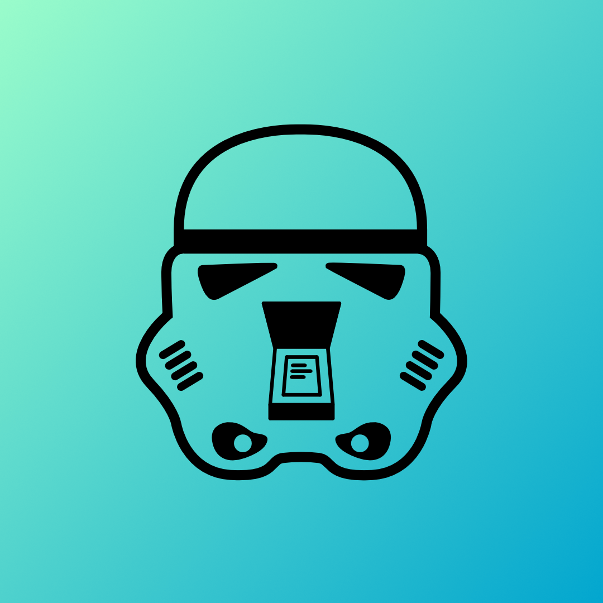

<div align="center">
  <a href="https://rebelscan.com"></a>

  <br/>

  <p><strong>Rebel Scan</strong> - A little scanner app made with the web, you rebel scum!</p>

  <br/>


[](https://github.com/peterpeterparker/rebelscan/releases/latest)
[](https://twitter.com/intent/tweet?url=https%3A%2F%2Ftietracker.com&text=A%20little%20scanner%20app%20made%20by%20%40daviddalbusco%20with%20the%20web%2C%20you%20rebel%20scum!)

</div>

## Table of contents

- [Getting Started](#getting-started)
- [Features](#features)
- [Technical Stack](#technical-stack)
- [Run Locally](#run-locally)
- [License](#license)

## Getting Started

Rebel Scan is a little, free and open source scanner application.

It has been developed during Christmas holidays (2020) because I was looking to try and, learn new things web related. I documented these learnings in a [blog post].

## Features

It scans documents in A4 format. It only applies a combination of filters (desaturate,saturation and contrast) on the source image. Nothing more, nothing else.

## Technical Stack

This app is developed with the [MediaDevices.getUserMedia()](https://developer.mozilla.org/en-US/docs/Web/API/MediaDevices/getUserMedia) API, [Next.js](https://nextjs.org/) and [Stencil](https://stenciljs.com/).

## Run Locally

To develop and run this documentation locally, proceed as following:

```
git clone https://github.com/peterpeterparker/rebelscan
cd rebelscan
npm ci
npm run dev
```

## License

This application is released under the GNU Affero General Public License. Copyright [David Dal Busco](mailto:david.dalbusco@outlook.com). See [COPYING](./COPYING) for more details.

[rebel scan]: https://rebelscan.com
